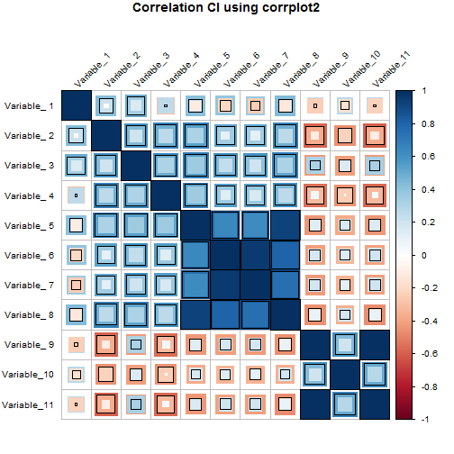
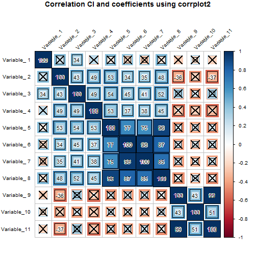

# corrplot2 documentation and examples
Extended functionality to the "corrplot" function from the corrplot package in R.
(see http://cran.r-project.org/web/packages/corrplot/index.html)  


## INSTALLATION  
There is no real installation. Download the file and source it (or paste it) into R.  
Or use this single line:

```r
# R command to get corrplot2 from github
source("https://raw.githubusercontent.com/dorianps/corrplot2/master/corrplot2.R")
```
If you want to permanently install it, download the `corrplot2.R` file and find the way to load it at startup (i.e. source in .Rprofile).


## DESCRIPTION  
The `corrplot2` function extends the functionality of the original `corrplot` function by providing more informative graphs and more controls on the parameters. Added options:  

`plotCI="fullcircle"`  
plots coefficients and confidence intervals and gives visually the right impression of which correlations are strongest  
  
`plotCI="fullsquare"`  
plots coefficients and confidence intervals and gives visually the right impression of which correlations are strongest  
  
`addCoef.cex = 0.8`  
font size of coefficients  

`addCoef.font = 2`  
font type of coefficients, 1=plain, 2=bold, 3=italic, 4=bold italic, 5=symbol  
  
`addCoef.labels = "all"`   
which cell to add coefficients, "all", "significant", "insignificant"  

`addCoef.outline = NULL`   
outline color of the coefficients, i.e. "white", "red"; helps distinguish text from background at all background colors  


## EXAMPLES  
Load example data:  

```r
# load example data from github
con = url("https://github.com/dorianps/corrplot2/blob/master/corrplot2example.Rdata?raw=true")
print(load(con))
close(con)
```


Plot correlation matrix using `corrplot`:   

```r
corrplot(temp[[1]], 
         cl.pos = "r", cl.align = "l", cl.ratio = 0.2,         
         tl.pos = "lt", tl.srt=45, tl.cex=0.8, tl.offset=0.5, tl.col="black",
         #low=imagingcorr[[3]], upp=temp[[4]], plotCI="square",
         method = "square", outline=1, diag=1,
         mar = c(0, 0, 1, 0),      
         title="Correlation matrix using corrplot")
```

 

The plot shows clearly which cells contain the highest correlations. But there is no information on confidence intervals.  
  
Plot correlation matrix using `corrplot` but this time with confidence intervals:   

```r
corrplot(temp[[1]], 
         cl.pos = "r", cl.align = "l", cl.ratio = 0.2,           
         tl.pos = "lt", tl.srt=45, tl.cex=0.8, tl.offset=0.5, tl.col="black",
         low=imagingcorr[[3]], upp=temp[[4]], plotCI="square",
         method = "square", outline=1, diag=1,
         mar = c(0, 0, 1, 0),        
         title="Correlation CI using corrplot")
```

 
  
The most significant correlation now look empty. This is visually misleading.  
  
Fix this using `corrplot2` and `plotCI="fullsquare"`:  
  

```r
corrplot2(temp[[1]], 
         cl.pos = "r", cl.align = "l", cl.ratio = 0.2,           
         tl.pos = "lt", tl.srt=45, tl.cex=0.8, tl.offset=0.5, tl.col="black",
         low=imagingcorr[[3]], upp=temp[[4]], plotCI="fullsquare",
         method = "square", outline=1, diag=1,
         mar = c(0, 0, 1, 0),        
         title="Correlation CI using corrplot2")
```

 
  
This is a lot mrore informative, and we also know where does the correlation value stand, the black border in each cell.  
  
The same can be done with circles:

```r
corrplot2(temp[[1]], 
         cl.pos = "r", cl.align = "l", cl.ratio = 0.2,           
         tl.pos = "lt", tl.srt=45, tl.cex=0.8, tl.offset=0.5, tl.col="black",
         low=imagingcorr[[3]], upp=temp[[4]], plotCI="fullcircle",
         method = "square", outline=1, diag=1,
         mar = c(0, 0, 1, 0),        
         title="Correlation CI using corrplot2")
```

 
  
  
###  Remember, the middle circle is the correlation coefficient (outlined in black), the outer circle is the higher CI, , and the inner circle the lower CI.
  
-------------------------------------------------------------------------------------  
  
Now add coefficients and use new options to control size, color, and placement, only for significant cells. Cross out insigificant cell:  
*(Check out the comments in each line to understand which parameter is doing what)*

```r
corrplot2(temp[[1]], 
         addrect = 3, rect.col = "red", rect.lwd=3,                        # rectangle around clusters if order="hclust"
          p.mat = temp[[2]], sig.level = 0.01,                      # insignificant crossouts
         insig="pch", pch.col="black",
         addCoef.col="black", addCoef.outline="white", addCoefasPercent=T, # add coefficients in plot
         addCoef.cex=0.9, addCoef.font=1, addCoef.labels="significant",    # other coefficient settings
         col=col2(100),                                                   # the colormap, inverted from original
         cl.pos = "r", cl.align = "l", cl.ratio = 0.2,                  # the settings of the legend on the side            
         tl.pos = "lt", tl.srt=45, tl.cex=0.8, tl.offset=0.5, tl.col="black",   # position and angle of variable names
         low=imagingcorr[[3]], upp=temp[[4]], plotCI="fullsquare",             # this is to create confidence interval graph
         method = "square", outline=1, diag=1,      # method, outline of squares, include or not diagonal
         mar = c(0, 0, 1, 0),                        # margins of the plot         
         #type="lower",
         title="Correlation CI and coefficients using corrplot2")
```

 
  
  
  
\*\*Note, the confidence intervals in the example dataset are calculated with a bootstrap procedure, they are not the regular confidence intervals obtained with `cor.test`.
